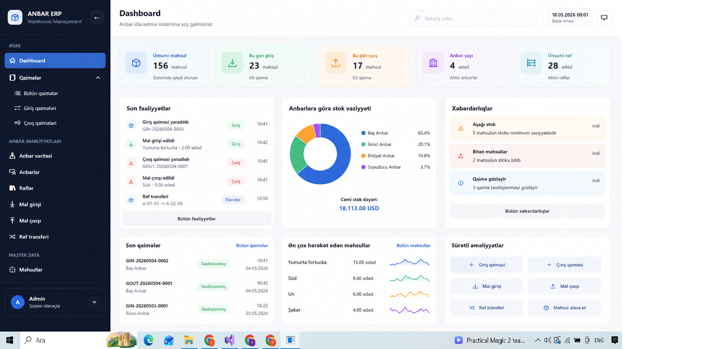
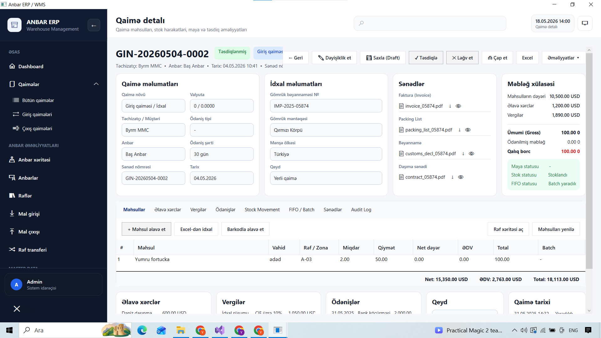
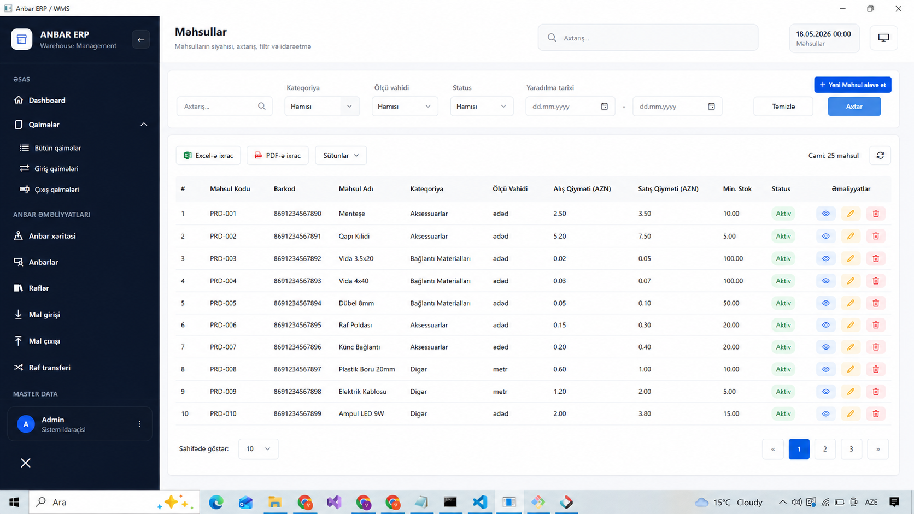
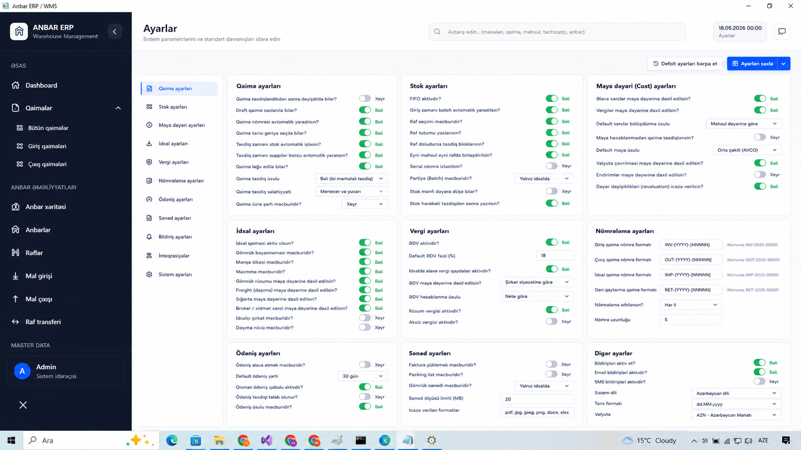

# Screenshots

## Dashboard

Warehouse analytics, stock monitoring, operational overview and financial statistics dashboard.

---

## Invoice Detail

Invoice workflow, stock movement tracking, FIFO operations and tax calculation management.

---

## Product Management

Product listing, filtering, export operations and inventory management interface.

---

## ERP Settings

ERP configuration panel including stock policies, valuation methods and system settings.

---
# ANBAR ERP & Warehouse Management System

## Sistem Haqqında

Anbar ERP & Warehouse Management System müəssisələrin gündəlik anbar, məhsul, alış, satış, stok və maliyyə proseslərini mərkəzləşdirilmiş şəkildə idarə etməsi üçün hazırlanmış enterprise səviyyəli desktop ERP həllidir.

Sistem real biznes axınlarına uyğun şəkildə qurulmuşdur və əsas məqsəd müəssisə daxilində bütün məhsul hərəkətlərini, maliyyə əməliyyatlarını və stok idarəçiliyini tam nəzarət altına almaqdır.

Layihə WPF (.NET) texnologiyası üzərində qurulmuşdur və müasir ERP sistemlərində istifadə olunan modul yanaşması ilə hazırlanmışdır.

Bu sistem:

* Anbar əməliyyatlarını idarə edir
* Məhsul hərəkətlərini izləyir
* Giriş və çıxış qaimələrini idarə edir
* Kateqoriya və məhsul strukturunu formalaşdırır
* Müştəri balanslarını nəzarətdə saxlayır
* Xərc və maya dəyəri hesablamaları aparır
* Vergi məntiqini idarə edir
* Dinamik field sistemi ilə genişlənə bilir
* Audit log ilə əməliyyat tarixçəsini saxlayır
* Dashboard və report sistemi ilə analiz təqdim edir

---

# Layihənin Məqsədi

Bu layihənin əsas məqsədi müəssisə daxilində müxtəlif şöbələrin istifadə edə biləcəyi vahid ERP və Warehouse Management platforması yaratmaqdır.

Sistem xüsusilə:

* Distribusiya şirkətləri
* Topdan satış müəssisələri
* Pərakəndə satış sistemləri
* İdxal və ixrac şirkətləri
* Multi warehouse strukturları
* Ticarət müəssisələri
* Mağaza şəbəkələri

üçün uyğun arxitektura ilə hazırlanmışdır.

---

# Əsas Funksional Modullar

## 1. Dashboard Modulu

Dashboard sistemi müəssisənin ümumi vəziyyətini real vaxt rejimində izləmək üçün nəzərdə tutulmuşdur.

Dashboard vasitəsilə:

* Ümumi satış statistikası
* Stok vəziyyəti
* Məhsul hərəkətləri
* Son əməliyyatlar
* Gəlir və xərc məlumatları
* Maliyyə göstəriciləri
* Aktiv istifadəçi əməliyyatları
* Kritik stok səviyyələri

kimi məlumatlar təqdim olunur.

Sistemdə bu hissə `DashboardService` vasitəsilə idarə olunur.

---

## 2. Məhsul İdarəetmə Sistemi

Product Management modulu ERP sisteminin əsas hissələrindən biridir.

Sistem məhsulların:

* yaradılması
* redaktəsi
* kateqoriyalara bölünməsi
* atributlarının idarə olunması
* qiymətlərinin saxlanılması
* stok miqdarlarının izlənməsi
* vergi parametrlərinin idarə olunması
* maya dəyərinin hesablanması

kimi əməliyyatları həyata keçirir.

### Məhsul Strukturu

Məhsullar aşağıdakı strukturlarla əlaqəlidir:

* Category
* ProductTax
* AttributeDefinition
* AttributeValue
* Shelf
* Invoice
* InvoiceItem

Bu struktur enterprise warehouse sistemlərinə uyğun relational model əsasında qurulmuşdur.

---

## 3. Kateqoriya Sistemi

Category Management sistemi məhsulların strukturlaşdırılmış şəkildə idarə olunmasına imkan yaradır.

Sistem:

* parent-child category strukturu
* məhsul qruplaşdırılması
* hierarchical category sistemi
* kateqoriya üzrə filtrasiya
* category based reporting

məntiqi ilə işləyir.

Bu modul `CategoryService` üzərindən idarə olunur.

---

## 4. Müştəri İdarəetmə Sistemi

Customer Management modulu müştərilərlə bağlı bütün məlumatların saxlanılması üçün nəzərdə tutulmuşdur.

Sistem aşağıdakı funksionallıqları təmin edir:

* Müştəri qeydiyyatı
* Balans izləmə
* Borc/alacaq nəzarəti
* Ödəniş tarixçəsi
* Müştəri əməliyyat logları
* Invoice əlaqələri
* Ödəniş əməliyyatları

### Müştəri Balans Sistemi

Customer balance sistemi real ERP məntiqinə uyğun şəkildə transaction əsaslı işləyir.

Bu hissədə:

* CustomerBalanceTransaction
* CustomerPayment
* InvoicePayment

strukturları istifadə olunur.

---

## 5. Giriş Qaiməsi Sistemi

Input Invoice sistemi müəssisəyə daxil olan məhsulların idarə olunması üçün hazırlanmışdır.

Bu modul:

* məhsul qəbulu
* alış əməliyyatları
* təchizatçıdan məhsul daxilolması
* maya dəyəri hesablanması
* əlavə xərclərin bölüşdürülməsi
* vergi hesablamaları
* stok artımı

kimi əməliyyatları idarə edir.

### Maya Dəyəri Hesablama

Sistemdə maya dəyəri hesablanması enterprise warehouse məntiqinə uyğun hazırlanmışdır.

`CostCalculationService` vasitəsilə:

* məhsulun ilkin dəyəri
* logistika xərcləri
* idxal xərcləri
* əlavə xidmət xərcləri
* vergi təsirləri

hesablanır.

---

## 6. Çıxış Qaiməsi Sistemi

Output Invoice sistemi məhsulların anbardan çıxışını idarə edir.

Bu hissədə:

* satış əməliyyatları
* məhsul çıxışı
* stok azalması
* invoice tracking
* customer invoice management
* vergi hesablamaları
* satış tarixçəsi

idarə olunur.

Sistem enterprise satış axınına uyğun transaction əsaslı işləyir.

---

## 7. Vergi Sistemi

Layihədə ayrıca vergi idarəetmə infrastrukturu mövcuddur.

Bu hissədə:

* məhsul vergiləri
* invoice vergiləri
* faiz əsaslı hesablamalar
* çoxsaylı vergi dəstəyi
* vergi mapping sistemi

istifadə olunur.

Əsas servis komponentləri:

* ProductTaxService
* InvoiceTaxService

---

## 8. Dinamik Field Sistemi

Sistemin ən vacib enterprise xüsusiyyətlərindən biri Dynamic Field sistemidir.

Bu mexanizm sayəsində:

* runtime field əlavə etmək
* custom metadata saxlamaq
* fərqli bizneslər üçün uyğunlaşmaq
* sistemin genişlənməsini təmin etmək

mümkündür.

İstifadə olunan entity strukturları:

* AttributeDefinition
* AttributeValue
* DynamicFieldService

Bu yanaşma ERP sistemlərində yüksək fleksibilik təmin edir.

---

## 9. Import Sistemi

Import sistemi xarici mənbələrdən məlumatların sistemə inteqrasiyası üçün hazırlanmışdır.

Sistem:

* Excel import
* Dynamic field mapping
* Import template sistemi
* Column matching
* configurable import settings

dəstəkləyir.

Əsas komponentlər:

* ImportInvoiceService
* ImportFieldSetting
* ImportSetting

---

## 10. Report Sistemi

Reporting sistemi müəssisə rəhbərliyi üçün analitik məlumatların təqdim olunması məqsədilə hazırlanmışdır.

Sistem aşağıdakı reportları dəstəkləyir:

* satış reportları
* stok reportları
* məhsul reportları
* invoice reportları
* maliyyə reportları
* balans reportları
* vergi reportları

Bu hissə `ReportService` vasitəsilə idarə olunur.

---

## 11. Audit Log Sistemi

Sistem daxilində bütün kritik əməliyyatlar audit log olaraq saxlanılır.

Audit sistemi:

* istifadəçi əməliyyatları
* data dəyişiklikləri
* təhlükəsizlik əməliyyatları
* sistem hərəkətləri
* giriş əməliyyatları

kimi məlumatları qeydə alır.

Bu yanaşma enterprise təhlükəsizlik standartlarına uyğun hazırlanmışdır.

---

# İstifadə Olunan Texnologiyalar

## Backend Texnologiyaları

* C#
* .NET
* Entity Framework Core
* LINQ
* SQL Server
* Dependency Injection
* Service Layer Architecture
* Repository Pattern məntiqi

---

## Frontend Texnologiyaları

* WPF
* XAML
* MVVM yanaşması
* Desktop UI architecture
* Responsive desktop layouts
* Data binding
* Custom controls

---

## Database Texnologiyaları

* Microsoft SQL Server
* Relational database architecture
* Entity Framework migrations
* Foreign key relationships
* Transaction management
* Data integrity controls

---

# Layihə Arxitekturası

Layihə enterprise layered architecture prinsiplərinə uyğun şəkildə hazırlanmışdır.

## Əsas Layerlər

### Entities Layer

Bütün database modelləri və business entity strukturları burada yerləşir.

Nümunə entitylər:

* Product
* Category
* Invoice
* Customer
* Shelf
* AuditLog
* CurrencyRate
* AppSetting

---

### Services Layer

Bütün biznes məntiqi servis qatında yerləşdirilmişdir.

Bu yanaşma:

* maintainability
* scalability
* testability
* clean architecture

üçün vacibdir.

Əsas servis strukturları:

* ProductService
* InvoiceService
* DashboardService
* CurrencyService
* ReportService
* SettingsService

---

### Views Layer

WPF UI hissəsi burada yerləşir.

Əsas səhifələr:

* DashboardView
* ProductsView
* CategoriesView
* ReportsView
* CustomersView
* InvoicesView
* ShelvesView
* SettingsView

---

### Data Layer

Database context və migration hissələri bu qatda yerləşir.

Bu hissədə:

* DbContext
* migrations
* seed data
* configuration

idarə olunur.

---

# Database Dizayn Məntiqi

Sistem relational database prinsiplərinə uyğun hazırlanmışdır.

Əsas relational əlaqələr:

* One-to-Many
* Many-to-One
* Many-to-Many
* Transaction based relations

İstifadə olunan əsas relational strukturlar:

* Product → Category
* Invoice → InvoiceItem
* Customer → Invoice
* Product → AttributeValue
* Invoice → Payments

Bu struktur enterprise ERP sistemlərinə uyğun qurulmuşdur.

---

# Təhlükəsizlik Sistemi

Sistemdə authentication və authorization infrastrukturu nəzərə alınmışdır.

Əsas təhlükəsizlik komponentləri:

* AuthService
* AdminUser entity
* Audit logging
* əməliyyat tarixçəsi
* user based access məntiqi

---

# Stok İdarəetmə Məntiqi

Warehouse management hissəsində məhsul hərəkətləri transaction əsaslı idarə olunur.

Sistem aşağıdakı məntiq ilə işləyir:

### Giriş Qaiməsi

* Məhsul daxil olur
* Stok artır
* Maya dəyəri hesablanır
* Vergi tətbiq olunur
* Audit log yazılır

### Çıxış Qaiməsi

* Məhsul anbardan çıxır
* Stok azalır
* Müştəri balansı dəyişir
* Invoice yaradılır
* Maliyyə əməliyyatı yaranır

---

# Shelf & Warehouse Structuring

Sistemdə məhsulların fiziki yerləşməsinin idarə olunması üçün Shelf sistemi mövcuddur.

Bu hissə:

* warehouse mapping
* shelf organization
* məhsul yerləşməsi
* fiziki stok nəzarəti

üçün istifadə olunur.

---

# Scalability və Gələcək İnkişaf

Sistem gələcəkdə aşağıdakı enterprise modulların əlavə olunmasına uyğun arxitektura ilə hazırlanmışdır:

* Multi warehouse support
* POS integration
* Barcode systems
* QR integrations
* Printer integrations
* AI analytics
* Mobile applications
* Cloud synchronization
* API integrations
* Real-time notifications
* Role based permissions
* Accounting modules
* Supplier management
* Purchase order systems
* Inventory forecasting

---

# Quraşdırma

## Tələblər

* Visual Studio
* .NET SDK
* SQL Server
* Windows Environment

---

## Run Etmək

1. Repository clone edilir
2. Database connection string konfiqurasiya olunur
3. Migrationlar tətbiq olunur
4. Project build edilir
5. WPF application işə salınır

---

# Nəticə

Anbar ERP & Warehouse Management System müəssisələrin gündəlik əməliyyatlarını mərkəzləşdirilmiş şəkildə idarə etməsi üçün hazırlanmış professional warehouse və ERP platformasıdır.

Layihə enterprise yanaşma ilə qurulmuşdur və gələcəkdə böyük biznes strukturlarına uyğun şəkildə genişləndirilə bilər.

Sistem həm texniki arxitektura, həm də biznes məntiqi baxımından real ERP sistemlərinin əsas prinsiplərinə uyğun hazırlanmışdır.
